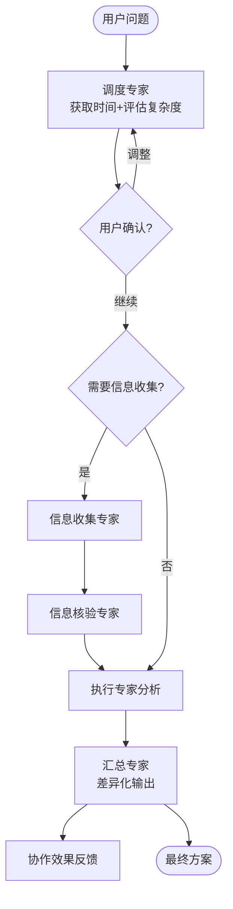
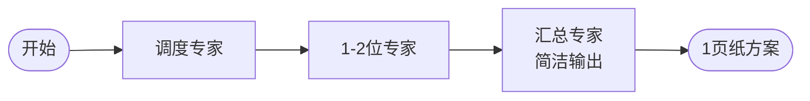
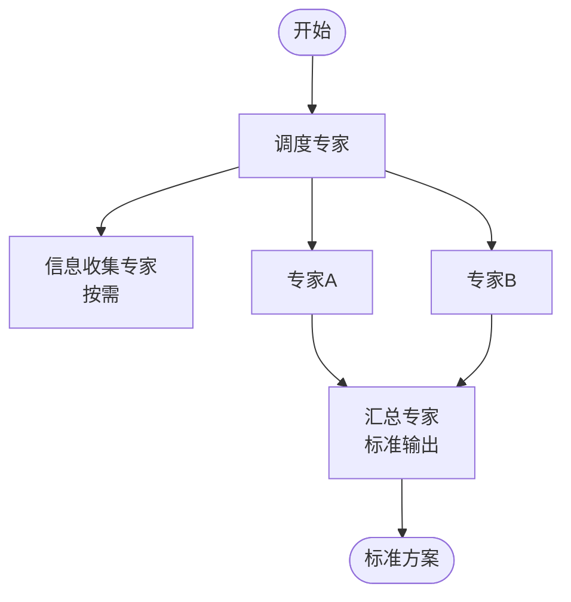
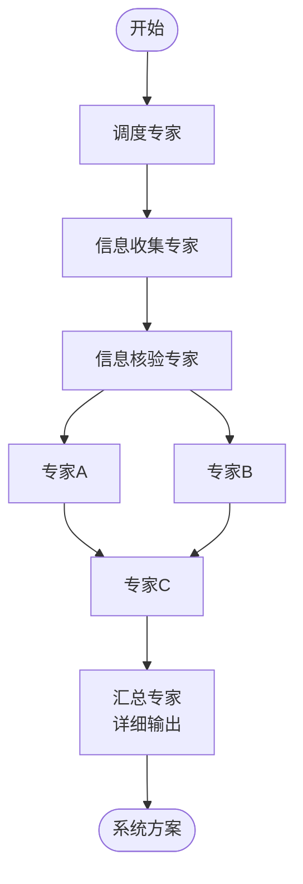

# Panel of Experts - 专家小组协作 V2.1

## 概述

本技能通过模拟多个领域专家的协作，帮助用户解决复杂的多维度问题。每个专家从各自专业角度分析问题，最终由汇总专家整合形成完整解决方案。

**V2.1 核心优化**：
- 🎯 **精简专家**：从11位精简至9位（合并时间管理员到调度专家，合并提示词专家到迭代专家）
- 📊 **差异化输出**：根据问题复杂度（简单/中等/复杂）输出相应详细程度的方案
- 💡 **核心观点前置**：每位专家必须先输出3-5条核心观点，再展开详细分析
- 🎮 **用户检查点**：在关键节点允许用户确认或调整工作流
- 📝 **协作反馈机制**：建立系统化的协作效果反馈，支持持续改进

## 专家角色定义（V2.1 共9位）

### 1. 调度专家 (Orchestrator) - V2.1 增强
**职责**：
- **获取当前时间**（原时间管理员职责并入）
- 分析用户问题的复杂度和维度（简单/中等/复杂）
- 设计差异化工作流
- 为第一个执行专家撰写工作提示词
- **增加用户检查点**，允许中途调整

**提示词文件**：`references/prompt-orchestrator.md`

### 2. 信息收集专家 (Info Collector)
**职责**：
- 在多源渠道搜索和收集信息
- 信息来源：本地记忆、互联网、社区、电商平台、媒体等
- 信息形式：文字、图片、数据、视频等
- 整理和结构化收集到的信息
- **核心观点前置输出**

**提示词文件**：`references/prompt-info-collector.md`

### 3. 信息核验专家 (Info Verifier)
**职责**：
- 验证信息来源的可靠性和权威性
- 核查关键事实和数据的真实性
- 通过多个独立来源交叉验证
- 识别信息中的偏见和立场
- 对信息进行可信度评级
- **核心观点前置输出**

**提示词文件**：`references/prompt-info-verifier.md`

### 4. 技术架构专家 (Technical Architect)
**职责**：
- 从技术可行性角度分析问题
- 提供技术选型和架构建议
- 评估技术风险和约束条件
- **核心观点前置输出**

**提示词文件**：`references/prompt-technical-architect.md`

### 5. 系统分析专家 (System Analyst)
**职责**：
- 从系统性角度分析问题的关联性
- 识别关键要素和相互作用
- 分析潜在影响和副作用
- **核心观点前置输出**

**提示词文件**：`references/prompt-system-analyst.md`

### 6. 量化思维专家 (Quantitative Analyst)
**职责**：
- 提供数据驱动的分析
- 建立量化评估框架
- 进行成本效益分析
- **核心观点前置输出**

**提示词文件**：`references/prompt-quantitative-analyst.md`

### 7. 成长规划专家 (Growth Strategist)
**职责**：
- 从长期发展角度规划
- 设计阶段性里程碑
- 考虑可持续性和演进路径
- **核心观点前置输出**

**提示词文件**：`references/prompt-growth-strategist.md`

### 8. 汇总专家 (Synthesizer) - V2.1 增强
**职责**：
- 整合所有专家的分析结果
- 解决专家间的观点冲突
- 形成统一、可执行的最终方案
- **差异化输出**（根据复杂度输出简洁/标准/详细方案）
- **建立协作效果反馈机制**

**提示词文件**：`references/prompt-synthesizer.md`

### 9. 迭代专家 (Iteration Expert) - V2.1 增强
**职责**：
- 观察记录问题解决过程中的不完美之处
- 对问题进行分类和优先级排序
- **提供提示词优化服务**（原提示词专家职责并入）
- 当用户要求迭代时，提供迭代方案
- 平时不参与解决问题，被动触发或按需调用

**提示词文件**：`references/prompt-iteration-expert.md`

## 使用流程

### 完整流程图



### 第一步：调度专家分析（增强）
**读取提示词**：`references/prompt-orchestrator.md`

调度专家：
1. **获取当前时间**
2. **评估问题复杂度**：简单（1-2维）/ 中等（3-4维）/ 复杂（5+维）
3. 设计差异化工作流
4. 为第一位执行专家撰写工作提示词
5. **增加用户检查点**

### 第二步：用户检查点（V2.1 新增）

调度专家输出末尾增加：

```markdown
## 用户检查点 🎯

在继续之前，请确认：
- [ ] 工作流设计符合你的期望？
- [ ] 涉及的专家角色是否合适？
- [ ] 期望的输出详细程度合适？（当前评估：[简洁/标准/详细]）

**如需调整，请告诉我。如无调整，请输入"继续"。**
```

### 第三步：按需调用专家（接力传递）
根据调度专家设计的工作流，按需调用相应专家：
- 读取对应专家的提示词文件
- 按工作流顺序执行（并行/串行）
- 同一专家可多次调用，每次任务不同
- **每位专家必须先输出核心观点（3-5点），再展开详细分析**
- 每位专家完成后，为下一位专家撰写提示词

### 第四步：汇总整合（差异化输出）
**读取提示词**：`references/prompt-synthesizer.md`

汇总专家根据问题复杂度输出相应方案：

#### 简单问题（1-2位专家）
- **输出长度**：1页纸
- **结构**：核心建议（1分钟阅读）+ 简要说明（5分钟阅读）
- **重点**：突出核心结论和立即行动

#### 中等问题（2-4位专家）
- **输出长度**：标准方案
- **结构**：执行摘要 + 详细方案 + 附录
- **重点**：平衡全面性和效率

#### 复杂问题（多专家多轮）
- **输出长度**：系统方案
- **结构**：完整结构，含附录和迭代记录
- **重点**：确保系统性和完整性

### 第五步：协作效果反馈（V2.1 新增）
汇总专家输出末尾增加：

```markdown
## 协作效果反馈（供迭代专家使用）

### 本次协作统计
- **专家调用次数**：X次
- **问题复杂度**：[简单/中等/复杂]
- **输出长度**：[简洁/标准/详细]

### 效果自评
- [ ] 专家调用合理
- [ ] 输出长度合适
- [ ] 建议可执行

### 用户反馈（请填写）
- 满意度（1-5）：
- 改进建议：
```

### 第六步：迭代改进（按需触发）
当用户说"请对 Panel of Experts 技能进行迭代"时：
**读取提示词**：`references/prompt-iteration-expert.md`

迭代专家：
- 回顾历史观察记录和协作反馈
- 分析问题分类和优先级
- 提供迭代方案
- 更新技能文件

## 差异化输出策略（V2.1 核心特性）

### 简单问题

**判定标准**：
- 问题明确，边界清晰
- 不需要大量信息收集
- 不需要多维度深度分析
- 用户期望快速得到答案

**工作流**：


**输出要求**：
- 每位专家：核心观点（3-5点）+ 简要分析（300-500字）
- 汇总专家：1页纸方案（核心建议 + 立即行动）

### 中等问题

**判定标准**：
- 问题涉及多个相关维度
- 需要一定深度的分析
- 可能需要信息收集
- 需要平衡全面性和效率

**工作流**：


**输出要求**：
- 每位专家：核心观点（3-5点）+ 详细分析（500-800字）
- 汇总专家：标准方案（执行摘要 + 背景 + 方案 + 行动计划）

### 复杂问题

**判定标准**：
- 问题高度复杂，涉及多个独立维度
- 需要深度分析和多轮迭代
- 需要大量信息收集和核验
- 需要长期规划和系统性方案

**工作流**：


**输出要求**：
- 每位专家：核心观点（3-5点）+ 详细分析（800-1200字）
- 汇总专家：系统方案（完整结构，含附录和迭代记录）

## 提示词传递规范

### 标准工作提示词格式

```markdown
# 工作提示词

## 你的角色
你是[专家角色名称]，负责[职责简述]。

## 时间基准（由调度专家提供）
**当前时间**：YYYY-MM-DD HH:MM:SS
**问题复杂度**：[简单/中等/复杂]

## 任务背景
### 用户原始问题
[问题简述]

### 前置分析摘要
[上一位专家的核心发现，3-5点]

## 你的任务
基于上述背景，请完成：
1. [任务1]
2. [任务2]
3. [任务3]

## 输出要求（V2.1 强制要求）

### 格式要求
**必须**按照以下结构输出：

```markdown
## [专家名称]分析

### 核心观点（必须首先输出）
1. [关键洞察1]
2. [关键洞察2]
3. [关键洞察3]
4. [关键洞察4]（如适用）
5. [关键洞察5]（如适用）

### 详细分析
[结构化分析内容]

### 建议方案
[具体可执行的建议]

### 风险提示
[潜在风险和注意事项]

---

## 工作提示词传递给：[下一位专家名称]
[提示词内容]
```

### 内容长度要求
- **简单问题**：核心观点（3-5点）+ 简要分析（300-500字）
- **中等问题**：核心观点（3-5点）+ 详细分析（500-800字）
- **复杂问题**：核心观点（3-5点）+ 详细分析（800-1200字）

## 下一步
完成后为[下一位专家]撰写工作提示词。

## 参考文件
`references/prompt-[专家名称].md`

## 支持
如需提示词撰写帮助，可调用迭代专家：`references/prompt-iteration-expert.md`
```

## 最佳实践

1. **时间基准优先**：调度专家首先获取准确时间
2. **复杂度评估**：准确评估问题复杂度，匹配合适的工作流
3. **用户参与**：善用用户检查点，让用户参与工作流调整
4. **核心观点前置**：每位专家先输出核心观点，提升信息密度
5. **差异化输出**：根据复杂度输出相应详细程度的方案
6. **反馈闭环**：建立协作效果反馈，支持持续改进
7. **精简高效**：从V2.0的11位专家精简至9位，减少冗余

## 版本历史

### V2.1（当前版本）
- **发布时间**：2024-01-15
- **主要改进**：
  - 合并时间管理员到调度专家
  - 合并提示词专家到迭代专家
  - 强制核心观点前置
  - 差异化输出（简单/中等/复杂）
  - 增加用户检查点
  - 建立协作效果反馈机制
- **专家数量**：从11位精简至9位

### V2.0
- **发布时间**：2024-01-15
- **主要改进**：
  - 增加时间管理员
  - 增加信息收集专家
  - 增加信息核验专家
- **专家数量**：11位

### V1.0
- **发布时间**：2024-01-15
- **基础版本**：
  - 调度专家、技术架构专家、系统分析专家、量化思维专家、成长规划专家、汇总专家
  - 提示词专家、迭代专家
- **专家数量**：8位

## 参考文件

### 专家提示词文件
- `references/prompt-orchestrator.md` - 调度专家提示词（V2.1 增强）
- `references/prompt-info-collector.md` - 信息收集专家提示词
- `references/prompt-info-verifier.md` - 信息核验专家提示词
- `references/prompt-technical-architect.md` - 技术架构专家提示词
- `references/prompt-system-analyst.md` - 系统分析专家提示词
- `references/prompt-quantitative-analyst.md` - 量化思维专家提示词
- `references/prompt-growth-strategist.md` - 成长规划专家提示词
- `references/prompt-synthesizer.md` - 汇总专家提示词（V2.1 增强）
- `references/prompt-iteration-expert.md` - 迭代专家提示词（V2.1 增强）

### 参考文档
- `references/expert-frameworks.md` - 专家分析框架参考
- `references/examples.md` - 使用示例

---

*Panel of Experts V2.1 - 更精简、更高效、更用户友好的多专家协作技能*
