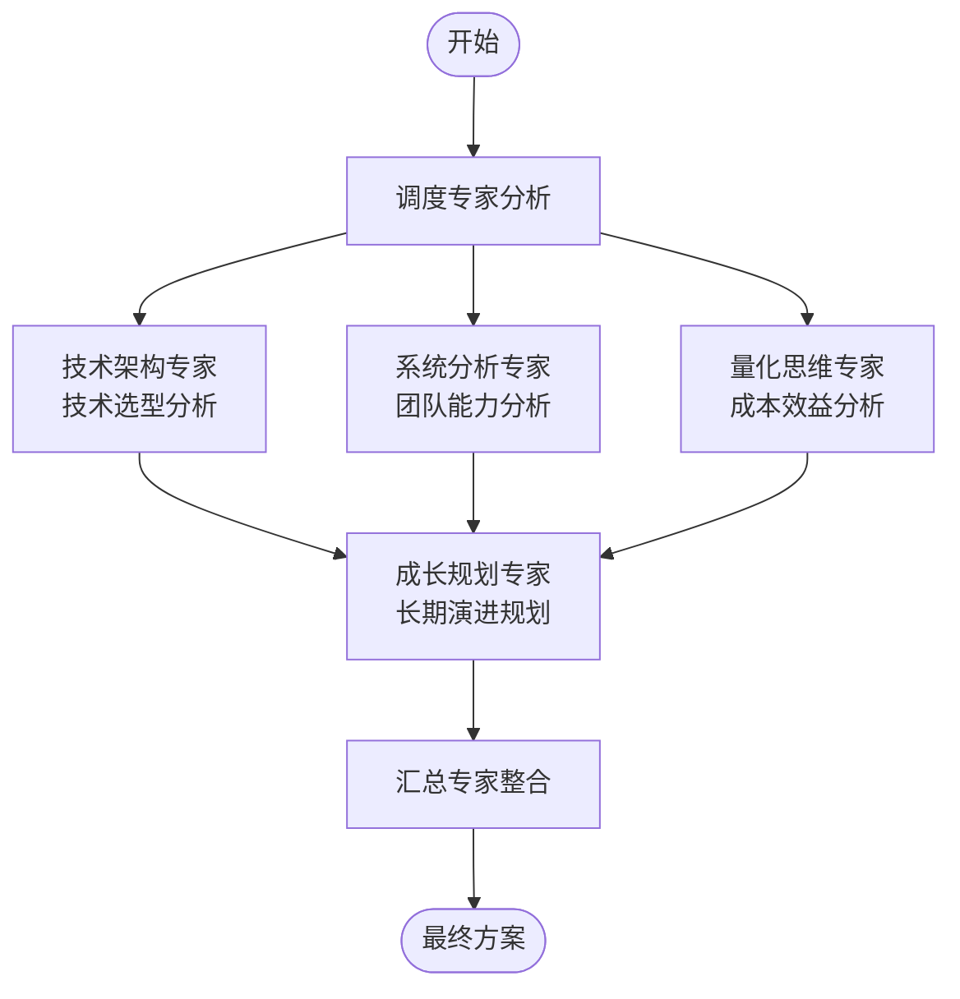
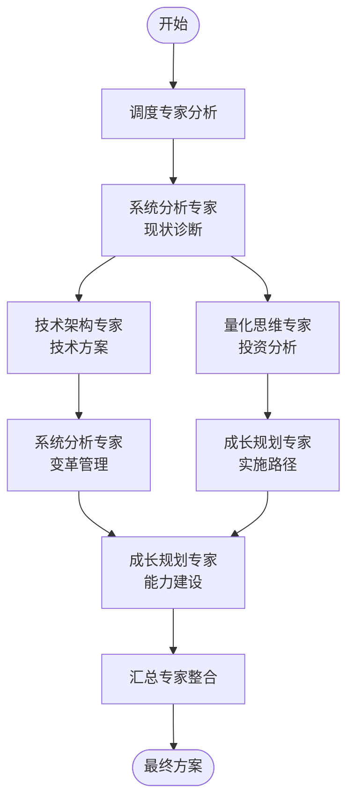
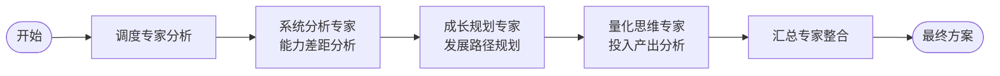

# Panel of Experts 使用示例

## 示例1：初创公司技术栈选型（并行工作流）

### 用户问题
"我们是一个5人的初创团队，要做一款SaaS产品，后端应该选Node.js还是Python？"

---

### 调度专家分析

## 调度专家分析

### 问题核心
为5人初创团队选择适合SaaS产品的后端技术栈

### 复杂度评估
- 等级：中等
- 涉及维度数：4个（技术特性、团队能力、成本效益、长期演进）
- 预计专家轮次：2轮

### 维度拆解
| 维度 | 描述 | 关联专家 | 优先级 |
|-----|-----|---------|-------|
| 技术特性 | 性能、生态、学习曲线 | 技术架构专家 | P0 |
| 团队能力 | 现有技能、学习成本 | 系统分析专家 | P0 |
| 成本效益 | 开发效率、运维成本 | 量化思维专家 | P1 |
| 长期演进 | 可维护性、招聘、扩展 | 成长规划专家 | P1 |

### 工作流设计

#### 工作流图示


#### 执行计划
**第一轮（并行）**：
- 技术架构专家：评估Node.js vs Python技术特性、性能、生态
- 系统分析专家：分析团队现有技能、学习成本、组织因素
- 量化思维专家：计算开发成本、运维成本、机会成本

**第二轮（串行）**：
- 成长规划专家：综合技术和成本分析，规划技术栈长期演进路线

**最终轮**：
- 汇总专家：整合所有分析，输出技术选型方案

---

### 第一轮专家分析（并行）

#### 技术架构专家分析

**核心观点**：
1. Node.js适合I/O密集型、实时性要求高的场景
2. Python适合数据密集型、AI集成的场景
3. 两者生态都很成熟，但方向略有不同

**技术选型矩阵**：

| 评估维度 | 权重 | Node.js | Python |
|---------|-----|---------|--------|
| 性能 | 15% | 9/10 | 7/10 |
| 生态 | 20% | 8/10 | 9/10 |
| 学习曲线 | 15% | 9/10 | 8/10 |
| 可维护性 | 15% | 8/10 | 9/10 |
| 扩展性 | 15% | 9/10 | 8/10 |
| 招聘市场 | 10% | 8/10 | 9/10 |
| 成本 | 10% | 9/10 | 8/10 |
| **加权总分** | 100% | **8.55** | **8.20** |

**建议**：如果产品涉及实时功能、前后端代码共享，选Node.js；如果涉及复杂数据处理、AI功能，选Python。

---

#### 系统分析专家分析

**利益相关者分析**：
| 利益相关者 | 影响力 | 利益度 | 态度 | 管理策略 |
|-----------|-------|-------|-----|---------|
| 创始团队 | 高 | 高 | 关注效率 | 充分沟通 |
| 技术团队 | 高 | 高 | 关注学习成本 | 技能培训 |
| 未来员工 | 中 | 中 | 关注技术栈吸引力 | 市场定位 |
| 投资人 | 中 | 中 | 关注技术风险 | 定期汇报 |

**团队能力评估**：
- 当前技能：团队有3年前端经验，熟悉JavaScript
- 学习成本：Node.js学习曲线平缓，Python需要额外学习
- 组织因素：全栈JavaScript统一降低认知负担

**建议**：优先考虑团队现有技能，Node.js可更快上手。

---

#### 量化思维专家分析

**成本效益分析**（假设6个月MVP开发）：

| 成本项 | Node.js | Python | 差异 |
|-------|---------|--------|-----|
| 开发时间 | 4个月 | 5个月 | 节省1个月 |
| 人员成本 | ¥40万 | ¥50万 | 节省¥10万 |
| 学习成本 | ¥2万 | ¥8万 | 节省¥6万 |
| 运维成本 | ¥3万/年 | ¥3万/年 | 持平 |
| **总成本** | **¥45万** | **¥61万** | **节省¥16万** |

**ROI计算**：
- 提前1个月上市，预计额外收益：¥20万
- 总ROI提升：35%

**建议**：从成本效益角度，Node.js更优。

---

### 第二轮专家分析（串行）

#### 成长规划专家分析

**基于前置分析的长期规划**：

**阶段1（0-6个月）**：快速MVP开发
- 选择Node.js，利用团队现有技能
- 目标：快速验证产品市场匹配

**阶段2（6-18个月）**：产品成熟化
- 根据产品方向决定是否引入Python服务
- 微服务架构支持多语言

**阶段3（18个月+）**：规模化
- 建立多语言技术栈能力
- 根据业务需求灵活选择技术

**技术演进路线图**：
```
当前：Node.js单体应用
    ↓ 6个月
微服务化：Node.js核心 + 专用服务
    ↓ 12个月
多语言：Node.js + Python（数据/AI服务）
```

**建议**：初期选择Node.js快速启动，预留架构演进空间。

---

### 汇总专家输出

```markdown
# 技术栈选型方案

## 执行摘要

建议采用 **Node.js** 作为初创阶段的后端技术栈，
预计节省开发成本¥16万，缩短上市时间1个月，
6个月后根据业务发展评估是否引入Python服务。

## 背景分析

### 问题定义
为5人初创团队选择SaaS产品后端技术栈，在Node.js和Python之间做决策。

### 约束条件
- 团队规模：5人（3前端背景）
- 时间压力：需快速推出MVP
- 资金限制：开发成本控制
- 技能现状：团队熟悉JavaScript

### 关键假设
- 产品初期不涉及复杂AI功能
- 团队愿意在必要时学习新技术
- 6个月后可获得新一轮融资

## 专家观点汇总

### 共识领域
- ✅ **开发效率优先**：所有专家认同初创阶段应优先考虑开发效率
- ✅ **团队技能匹配**：应充分利用团队现有JavaScript技能
- ✅ **架构可演进**：技术栈选择不应限制未来演进

### 专家核心贡献
| 专家 | 核心贡献 | 关键建议 |
|-----|---------|---------|
| 技术架构专家 | 技术特性对比分析 | Node.js在实时性和扩展性上略优 |
| 系统分析专家 | 团队能力评估 | 全栈JavaScript降低认知负担 |
| 量化思维专家 | 成本效益量化 | Node.js节省¥16万，ROI提升35% |
| 成长规划专家 | 长期演进规划 | 预留多语言架构演进空间 |

### 观点冲突与解决

#### 冲突1：技术最优 vs 成本最优
- **涉及专家**：技术架构专家 vs 量化思维专家
- **分歧点**：Python生态更成熟 vs Node.js成本更低
- **解决方案**：初创阶段优先成本效益，技术差距可通过架构设计弥补
- **决策依据**：初创公司生存优先，快速验证比技术完美更重要

## 解决方案

### 整体策略
**"快速启动，渐进演进"**

### 技术选型决策
**推荐：Node.js**

**选择理由**：
1. 团队技能匹配度高，学习成本低
2. 开发效率高，可缩短上市时间1个月
3. 节省成本¥16万，提升ROI 35%
4. 技术特性满足SaaS产品需求

### 分阶段方案

#### 阶段1：快速启动（0-6个月）
**目标**：完成MVP开发并上线

**技术栈**：
- 后端：Node.js + Express/NestJS
- 数据库：PostgreSQL
- 缓存：Redis
- 部署：Docker + AWS/阿里云

**关键行动**：
| 序号 | 行动项 | 负责人 | 交付物 | 完成标准 |
|-----|-------|-------|-------|---------|
| 1 | 搭建Node.js项目脚手架 | 技术负责人 | 代码仓库 | 可运行的基础框架 |
| 2 | 设计数据库Schema | 后端开发 | 设计文档 | 通过评审 |
| 3 | 实现核心API | 后端团队 | API服务 | 单元测试通过 |
| 4 | 部署上线 | 运维 | 生产环境 | 可用性>99% |

**成功标准**：
- MVP按时上线
- 核心功能稳定运行
- 获得首批付费用户

#### 阶段2：产品成熟（6-18个月）
**目标**：产品功能完善，用户规模增长

**技术演进**：
- 微服务化拆分
- 引入消息队列（RabbitMQ/Kafka）
- 建立CI/CD流水线

**成功标准**：
- 日活用户>1000
- 系统支持水平扩展
- 建立技术团队规范

#### 阶段3：规模扩张（18个月+）
**目标**：支持大规模用户，技术栈多元化

**技术演进**：
- 根据业务需求引入Python服务（数据/AI）
- 建立多语言微服务架构
- 完善监控和可观测性

**决策点**：第12个月评估是否引入Python
- 触发条件：产品涉及AI功能或数据分析需求
- 实施方案：独立Python服务，通过API与Node.js服务通信

## 行动计划

### 立即行动（本周）
- [ ] 确定Node.js框架（Express vs NestJS）- 负责人：技术负责人 - 截止时间：本周五
- [ ] 搭建开发环境 - 负责人：全团队 - 截止时间：本周五

### 短期行动（本月）
- [ ] 完成数据库设计 - 负责人：后端开发 - 截止时间：本月末
- [ ] 实现用户认证模块 - 负责人：后端开发 - 截止时间：本月末

### 中期行动（3个月内）
- [ ] 完成MVP核心功能 - 负责人：全团队 - 截止时间：第3月末
- [ ] 完成测试和优化 - 负责人：QA+开发 - 截止时间：第3月末

## 资源需求

### 人力资源
| 角色 | 人数 | 技能要求 | 获取方式 | 时间 |
|-----|-----|---------|---------|-----|
| Node.js后端开发 | 2 | Node.js, PostgreSQL | 内部培养 | 已有 |
| 前端开发 | 2 | React/Vue | 已有 | 已有 |
| 技术负责人 | 1 | 全栈架构 | 已有 | 已有 |

### 资金需求
| 用途 | 金额 | 时间 | 备注 |
|-----|-----|-----|-----|
| 云服务器 | ¥2万 | 每月 | AWS/阿里云 |
| 开发工具 | ¥1万 | 一次性 | IDE, 监控工具等 |
| 第三方服务 | ¥3万 | 6个月 | 短信、支付等 |
| **总计** | **¥6万** | 6个月 | |

### 技术资源
- 开发框架：NestJS（推荐）或 Express
- 数据库：PostgreSQL
- 缓存：Redis
- 部署：Docker + Kubernetes（后期）

## 风险与应对

### 风险矩阵
| 风险项 | 概率 | 影响 | 风险等级 | 应对策略 | 责任人 |
|-------|-----|-----|---------|---------|-------|
| Node.js性能瓶颈 | 中 | 中 | 中 | 提前设计缓存策略，预留优化空间 | 技术负责人 |
| 团队Node.js经验不足 | 中 | 中 | 中 | 安排培训，引入代码审查 | 技术负责人 |
| 后期需要AI功能 | 中 | 高 | 高 | 预留Python服务接入点 | 架构师 |
| 招聘Node.js人才困难 | 低 | 中 | 低 | 建立技术品牌，提供有竞争力薪酬 | HR |

### 关键风险详述

#### 风险1：后期AI功能需求
- **风险描述**：产品后期需要机器学习功能，Node.js生态不足
- **触发条件**：产品路线图包含AI功能
- **影响分析**：可能需要重构或引入新技术栈
- **预防措施**：微服务架构设计，预留Python服务接入点
- **应急预案**：独立Python服务，通过REST/gRPC与Node.js通信

## 成功指标

### 关键结果指标（KR）
| 指标 | 目标值 | 测量方式 | 频率 |
|-----|-------|---------|-----|
| MVP上线时间 | 4个月 | 实际上线日期 | 里程碑 |
| 开发成本控制 | <¥50万 | 财务统计 | 每月 |
| 系统可用性 | >99.5% | 监控数据 | 实时 |
| 代码质量 | 测试覆盖率>80% | 自动化测试 | 每次发布 |

### 里程碑检查点
- **检查点1**（第1个月）：技术架构评审通过
- **检查点2**（第3个月）：MVP功能完成度>80%
- **检查点3**（第6个月）：MVP成功上线

## 附录

### 决策记录
| 序号 | 决策内容 | 决策时间 | 决策依据 | 决策人 |
|-----|---------|---------|---------|-------|
| 1 | 选择Node.js而非Python | 2024-01 | 成本效益分析、团队技能匹配 | 技术负责人 |
| 2 | 采用NestJS框架 | 2024-01 | 企业级特性、TypeScript支持 | 技术团队 |

### 版本历史
| 版本 | 时间 | 修改内容 | 修改人 |
|-----|-----|---------|-------|
| V1.0 | 2024-01-15 | 初始版本 | Panel of Experts |

---

*本方案由 Panel of Experts 协作生成，建议根据实际情况定期回顾和调整。*
```

---

## 示例2：企业数字化转型（混合工作流，专家多次调用）

### 用户问题
"我们是一家传统制造企业，有500名员工，想做数字化转型，从哪开始？"

---

### 调度专家分析

## 调度专家分析

### 问题核心
为500人传统制造企业设计数字化转型启动策略和实施路径

### 复杂度评估
- 等级：复杂
- 涉及维度数：6个（现状诊断、技术架构、组织变革、投资回报、实施路径、能力建设）
- 预计专家轮次：3轮
- 专家多次调用：系统分析专家（2次）、成长规划专家（2次）

### 维度拆解
| 维度 | 描述 | 关联专家 | 优先级 |
|-----|-----|---------|-------|
| 现状诊断 | 数字化成熟度评估 | 系统分析专家 | P0 |
| 技术架构 | 系统选型和集成方案 | 技术架构专家 | P0 |
| 组织变革 | 流程再造、人员培训 | 系统分析专家 | P1 |
| 投资回报 | 优先级排序、预算规划 | 量化思维专家 | P0 |
| 实施路径 | 阶段规划、里程碑 | 成长规划专家 | P0 |
| 能力建设 | 人才培养、文化塑造 | 成长规划专家 | P1 |

### 工作流设计

#### 工作流图示


#### 执行计划
**第一轮**：
- 系统分析专家（第1次）：现状诊断、痛点识别、利益相关者分析

**第二轮（并行）**：
- 技术架构专家：基于现状设计技术方案
- 量化思维专家：投资回报分析和优先级排序

**第三轮（并行）**：
- 系统分析专家（第2次）：变革管理策略、组织调整方案
- 成长规划专家（第1次）：实施路径和阶段规划

**第四轮**：
- 成长规划专家（第2次）：能力建设和文化塑造

**最终轮**：
- 汇总专家：整合所有分析，输出完整转型方案

---

### 第一轮：系统分析专家（第1次）- 现状诊断

**核心观点**：
1. 企业数字化成熟度低，生产管理仍依赖纸质流程
2. 关键痛点集中在生产可视化和供应链协同
3. 中层管理人员可能是变革的主要阻力

**数字化成熟度评估**：
| 维度 | 当前状态 | 成熟度 | 优先级 |
|-----|---------|-------|-------|
| 生产管理 | 纸质工单、人工统计 | 低 | P0 |
| 供应链 | Excel管理、电话沟通 | 低 | P0 |
| 销售 | 传统渠道、CRM缺失 | 中低 | P1 |
| 财务 | 财务软件基础应用 | 中 | P2 |
| 人力资源 | 基础考勤、纸质档案 | 低 | P2 |

**利益相关者分析**：
- **高层领导**：支持转型，关注投资回报
- **中层管理**：担心权力削弱，可能抵触
- **一线员工**：担心工作量和技能要求
- **IT部门**：能力有限，需要外部支持

---

### 第二轮：技术架构专家 + 量化思维专家（并行）

#### 技术架构专家分析

**技术方案建议**：

**阶段1（0-6个月）**：基础设施
- 云基础设施：阿里云/华为云
- 统一身份认证
- 数据仓库基础

**阶段2（6-18个月）**：核心业务系统
- MES（制造执行系统）- 优先级最高
- ERP升级或替换
- SCM（供应链管理系统）

**阶段3（18-36个月）**：智能化应用
- 生产数据分析平台
- 预测性维护
- 智能排产

#### 量化思维专家分析

**投资回报分析**：

| 项目 | 投资金额 | 预期年收益 | 回收期 | 优先级 |
|-----|---------|-----------|-------|-------|
| MES系统 | ¥200万 | ¥150万 | 1.3年 | P0 |
| SCM系统 | ¥180万 | ¥120万 | 1.5年 | P0 |
| 数据平台 | ¥150万 | ¥80万 | 1.9年 | P1 |
| ERP升级 | ¥300万 | ¥100万 | 3年 | P1 |

**建议优先级**：MES > SCM > 数据平台 > ERP

---

### 第三轮：系统分析专家（第2次）+ 成长规划专家（第1次）（并行）

#### 系统分析专家（第2次）- 变革管理

**基于技术方案和成本分析的变革策略**：

**变革阻力分析**：
| 群体 | 阻力来源 | 阻力等级 | 应对策略 |
|-----|---------|---------|---------|
| 中层管理 | 权力削弱担忧 | 高 | 参与决策、明确角色 |
| 一线员工 | 技能焦虑 | 中 | 充分培训、激励机制 |
| IT部门 | 能力不自信 | 中 | 外部支持、能力提升 |

**变革管理策略**：
- 建立变革委员会，中层参与决策
- 设立数字化先锋奖，激励积极参与者
- 与高校合作，提供系统培训

#### 成长规划专家（第1次）- 实施路径

**基于前置分析的实施路线图**：

**Phase 1：试点突破（6个月）**
- 选择1个车间进行MES试点
- 建立数字化团队（5-8人）
- 目标：生产效率提升10%

**Phase 2：横向扩展（12个月）**
- MES推广到全厂
- ERP系统升级
- 目标：整体运营效率提升15%

**Phase 3：深化应用（18个月）**
- 供应链协同平台
- 数据分析应用
- 目标：建立数字化运营能力

---

### 第四轮：成长规划专家（第2次）- 能力建设

**基于实施路径的能力建设规划**：

**数字化人才培养计划**：
| 角色 | 人数 | 培养方式 | 时间 |
|-----|-----|---------|-----|
| 数字化专员 | 20人 | 内部选拔+培训 | 6个月 |
| 数据分析师 | 5人 | 外部招聘+培养 | 12个月 |
| 系统管理员 | 3人 | 厂商培训 | 3个月 |

**文化建设**：
- 每月数字化分享会
- 数字化创新大赛
- 高管数字化领导力培训

---

### 汇总专家输出

```markdown
# 企业数字化转型方案

## 执行摘要

建议采用 **"试点突破、价值驱动、渐进推广"** 的转型策略，
3年投入¥1400万，预期ROI 150%，
从MES系统试点开始，分3个阶段实现全面数字化。

## 背景分析

### 问题定义
为500人传统制造企业设计数字化转型启动策略和实施路径。

### 约束条件
- 企业规模：500人，传统制造
- 数字化基础薄弱，纸质流程为主
- 预算约束：3年¥1400万
- 组织变革阻力：中层管理可能抵触

### 关键假设
- 高层持续支持转型
- 能找到合适的实施伙伴
- 员工愿意接受培训和变革

## 专家观点汇总

### 共识领域
- ✅ **试点先行**：所有专家认同应先试点再推广
- ✅ **价值驱动**：优先投资高ROI项目
- ✅ **变革管理**：技术只是手段，组织变革是关键

### 专家核心贡献
| 专家 | 核心贡献 | 关键建议 |
|-----|---------|---------|
| 系统分析专家(1) | 现状诊断和痛点识别 | 生产可视化是首要痛点 |
| 技术架构专家 | 技术方案和架构设计 | 云原生+微服务架构 |
| 量化思维专家 | ROI分析和优先级排序 | MES和SCM优先级最高 |
| 系统分析专家(2) | 变革管理策略 | 中层参与、激励机制 |
| 成长规划专家(1) | 实施路径规划 | 3阶段18个月路线图 |
| 成长规划专家(2) | 能力建设规划 | 20名数字化专员培养 |

### 观点冲突与解决

#### 冲突1：全面改造 vs 渐进演进
- **涉及专家**：技术架构专家 vs 成长规划专家
- **分歧点**：技术架构建议全面云原生改造 vs 成长规划建议渐进演进
- **解决方案**：技术架构设计预留全面改造空间，实施按渐进路线
- **决策依据**：平衡技术最优与组织变革可承受度

## 解决方案

### 整体策略
**"小步快跑，价值驱动，组织先行"**

### 转型蓝图

#### 技术架构
- **基础设施**：混合云架构，核心系统上云
- **应用架构**：微服务化，API网关统一接口
- **数据架构**：数据湖+数据仓库，统一数据治理

#### 实施路线图

##### Phase 1：试点突破（0-6个月）
**目标**：验证数字化价值，建立信心

**关键行动**：
| 序号 | 行动项 | 负责人 | 交付物 | 完成标准 |
|-----|-------|-------|-------|---------|
| 1 | 成立数字化转型委员会 | CEO | 组织架构 | 委员会成立 |
| 2 | 选择试点车间 | 生产总监 | 试点方案 | 方案评审通过 |
| 3 | MES系统试点实施 | 项目组 | MES系统 | 生产效率提升10% |
| 4 | 数字化团队组建 | HR总监 | 团队到位 | 5-8人团队 |

**投资**：¥400万

##### Phase 2：横向扩展（6-18个月）
**目标**：全面数字化，运营效率提升

**关键行动**：
| 序号 | 行动项 | 负责人 | 交付物 | 完成标准 |
|-----|-------|-------|-------|---------|
| 1 | MES全面推广 | 生产总监 | 全厂覆盖 | 所有车间上线 |
| 2 | ERP系统升级 | IT总监 | 新ERP系统 | 财务业务一体化 |
| 3 | 数据平台上线 | CIO | 数据平台 | 核心报表自动化 |
| 4 | 数字化培训 | HR总监 | 培训体系 | 500人培训完成 |

**投资**：¥600万

##### Phase 3：深化应用（18-36个月）
**目标**：智能化运营，数据驱动决策

**关键行动**：
| 序号 | 行动项 | 负责人 | 交付物 | 完成标准 |
|-----|-------|-------|-------|---------|
| 1 | 供应链协同平台 | 供应链总监 | SCM系统 | 供应商协同率>80% |
| 2 | 生产数据分析 | 数据团队 | 分析应用 | 预测准确率>85% |
| 3 | 智能排产试点 | 生产总监 | 智能排产 | 排产效率提升20% |

**投资**：¥400万

## 行动计划

### 立即行动（本月）
- [ ] 成立数字化转型委员会 - 负责人：CEO - 截止时间：本月末
- [ ] 启动MES vendor选型 - 负责人：CIO - 截止时间：本月末
- [ ] 制定Change Management计划 - 负责人：HR总监 - 截止时间：本月末

### 短期行动（3个月内）
- [ ] 完成MES试点上线 - 负责人：项目组 - 截止时间：第3月末
- [ ] 数字化团队到位 - 负责人：HR总监 - 截止时间：第2月末
- [ ] 完成现状流程梳理 - 负责人：生产总监 - 截止时间：第2月末

### 中期行动（12个月内）
- [ ] MES全面推广完成 - 负责人：生产总监 - 截止时间：第12月末
- [ ] ERP升级完成 - 负责人：IT总监 - 截止时间：第12月末
- [ ] 数字化专员培养完成 - 负责人：HR总监 - 截止时间：第12月末

## 资源需求

### 人力资源
| 角色 | 人数 | 技能要求 | 获取方式 | 时间 |
|-----|-----|---------|---------|-----|
| 数字化项目经理 | 1 | PMP, 制造业经验 | 外部招聘 | 第1月 |
| 数字化专员 | 20 | 业务+技术复合 | 内部选拔+培训 | 第6月 |
| 数据分析师 | 5 | 数据分析, SQL | 外部招聘 | 第6月 |
| 系统管理员 | 3 | IT运维 | 厂商培训 | 第3月 |

### 资金需求
| 用途 | 金额 | 时间 | 备注 |
|-----|-----|-----|-----|
| MES系统 | ¥380万 | Year 1 | 含实施费用 |
| ERP升级 | ¥300万 | Year 2 | 含定制开发 |
| 基础设施 | ¥200万 | Year 1 | 云资源+网络 |
| 培训咨询 | ¥150万 | 3年 | 变革管理+技能培训 |
| 数据平台 | ¥150万 | Year 2 | 含BI工具 |
| SCM系统 | ¥180万 | Year 3 | 供应链协同 |
| 应急储备 | ¥140万 | 3年 | 10%储备金 |
| **总计** | **¥1400万** | 3年 | |

### 技术资源
- 云服务商：阿里云/华为云
- MES厂商：西门子/用友/鼎捷
- ERP厂商：SAP/用友/金蝶
- 实施伙伴：有制造业经验的SI

## 风险与应对

### 风险矩阵
| 风险项 | 概率 | 影响 | 风险等级 | 应对策略 | 责任人 |
|-------|-----|-----|---------|---------|-------|
| 实施延期 | 中 | 高 | 高 | 分阶段交付，预留缓冲 | 项目经理 |
| 用户抵制 | 中 | 高 | 高 | 变革管理，激励机制 | HR总监 |
| 供应商不稳定 | 低 | 高 | 中 | 多供应商策略，合同约束 | CIO |
| 技术集成困难 | 中 | 中 | 中 | 聘请有经验集成商 | CIO |
| 预算超支 | 中 | 中 | 中 | 10%应急储备，严格变更控制 | CFO |

### 关键风险详述

#### 风险1：组织变革阻力
- **风险描述**：中层管理人员抵制变革，影响项目推进
- **触发条件**：变革触及部门利益或权力结构
- **影响分析**：项目延期，甚至失败
- **预防措施**：
  - 变革委员会纳入中层代表
  - 明确数字化后的角色定位
  - 设立变革先锋奖
- **应急预案**：调整变革节奏，加强沟通和培训

#### 风险2：技术集成困难
- **风险描述**：新旧系统集成复杂，数据打通困难
- **触发条件**：系统间接口不兼容，数据标准不一致
- **影响分析**：项目延期，额外成本
- **预防措施**：
  - 前期充分调研现有系统
  - 制定数据标准和接口规范
  - 聘请有经验的系统集成商
- **应急预案**：分阶段集成，优先核心业务

## 成功指标

### 关键结果指标（KR）
| 指标 | 目标值 | 测量方式 | 频率 |
|-----|-------|---------|-----|
| 生产效率提升 | >15% | 单位时间产出 | 每季度 |
| 库存周转率提升 | >20% | 库存周转天数 | 每季度 |
| 订单交付周期缩短 | >25% | 订单到交付时间 | 每月 |
| 数据报表自动化率 | >90% | 自动/总报表数 | 每季度 |
| 员工数字化技能达标率 | >80% | 培训考核 | 每半年 |

### 里程碑检查点
- **检查点1**（第6个月）：MES试点成功，效率提升10%
- **检查点2**（第12个月）：MES全面推广，运营效率提升15%
- **检查点3**（第24个月）：数据平台上线，决策效率提升
- **检查点4**（第36个月）：智能化应用，建立数字化运营能力

## 附录

### 决策记录
| 序号 | 决策内容 | 决策时间 | 决策依据 | 决策人 |
|-----|---------|---------|---------|-------|
| 1 | 优先实施MES系统 | 2024-01 | ROI分析，生产痛点最突出 | 转型委员会 |
| 2 | 采用渐进式转型策略 | 2024-01 | 组织变革可承受度评估 | 转型委员会 |
| 3 | 3年投入¥1400万 | 2024-01 | 投资回报分析 | CFO |

### 版本历史
| 版本 | 时间 | 修改内容 | 修改人 |
|-----|-----|---------|-------|
| V1.0 | 2024-01-15 | 初始版本 | Panel of Experts |

---

*本方案由 Panel of Experts 协作生成，建议根据实际情况定期回顾和调整。*
```

---

## 示例3：个人职业发展规划（串行工作流）

### 用户问题
"我做了3年前端开发，想转型做产品经理，应该怎么规划？"

---

### 调度专家分析

## 调度专家分析

### 问题核心
前端开发工程师转型产品经理的职业发展路径规划

### 复杂度评估
- 等级：中等
- 涉及维度数：4个（能力差距、转型策略、时间规划、风险评估）
- 预计专家轮次：3轮（串行）

### 工作流设计

#### 工作流图示


#### 执行计划
**第一轮（串行）**：
- 系统分析专家：分析产品经理能力模型，评估当前能力差距

**第二轮（串行）**：
- 成长规划专家：基于能力差距，设计学习路径和发展阶段

**第三轮（串行）**：
- 量化思维专家：评估转型投入产出，进行风险分析

**最终轮**：
- 汇总专家：整合所有分析，输出转型方案

---

### 第一轮：系统分析专家 - 能力差距分析

**产品经理能力模型**：
| 能力维度 | 前端开发 | 产品经理 | 差距 | 可迁移性 |
|---------|---------|---------|-----|---------|
| 用户理解 | 界面实现 | 需求洞察 | 中 | 高（有用户视角） |
| 沟通协调 | 技术对接 | 跨部门协调 | 大 | 中（需扩展） |
| 数据分析 | 性能指标 | 业务指标 | 大 | 中（逻辑相通） |
| 商业思维 | 技术实现 | 商业模式 | 大 | 低（需新建） |
| 项目管理 | 任务管理 | 产品规划 | 中 | 高（有基础） |

**差距分析结论**：
- 核心差距：商业思维、数据分析、跨部门协调
- 可迁移优势：用户视角、技术理解、执行力

---

### 第二轮：成长规划专家 - 发展路径规划

**基于能力差距的成长路径**：

**阶段1：准备期（3-6个月）**
- 目标：建立产品思维基础，完成能力补全
- 关键任务：
  - [ ] 系统学习产品方法论
  - [ ] 参与产品讨论，承担产品相关工作
  - [ ] 建立产品知识库

**阶段2：实践期（6-12个月）**
- 目标：积累产品实战经验
- 关键任务：
  - [ ] 主导1-2个小型功能的产品设计
  - [ ] 建立跨部门协作关系
  - [ ] 积累数据分析和用户研究经验

**阶段3：转型期（12-18个月）**
- 目标：完成正式转型
- 关键任务：
  - [ ] 申请内部转岗或寻找外部机会
  - [ ] 准备产品经理面试
  - [ ] 建立产品人脉网络

---

### 第三轮：量化思维专家 - 投入产出分析

**投入成本**：
- 学习时间：每周10-15小时 × 18个月 ≈ 500-700小时
- 机会成本：可能的晋升机会、技术深度积累
- 经济成本：课程费用 ≈ 2000-5000元

**预期收益**：
- 薪资变化：初级PM可能略低于资深前端，但长期天花板更高
- 职业满意度：如果确实对产品工作有热情，非经济收益显著
- 转型成功率：基于充分准备，估计70-80%

**风险评估**：
| 风险项 | 概率 | 影响 | 应对策略 |
|-------|-----|-----|---------|
| 转型失败 | 20-30% | 高 | 保持技术能力，可回归开发 |
| 收入下降 | 50% | 中 | 储备6个月生活费 |
| 不适应PM工作 | 30% | 高 | 先尝试兼职/辅助产品工作 |

---

### 汇总专家输出

```markdown
# 前端开发转型产品经理方案

## 执行摘要

建议采用 **"内部渐进式转型"** 策略，
18个月完成转型，投入约500-700小时学习时间，
转型成功率预计70-80%，需储备6个月生活费应对收入波动。

## 背景分析

### 问题定义
3年前端开发工程师转型产品经理的职业规划。

### 能力差距
- **核心差距**：商业思维、数据分析、跨部门协调
- **可迁移优势**：用户视角、技术理解、执行力

### 关键假设
- 对产品经理工作有真实兴趣和热情
- 当前公司有产品岗位或转岗机会
- 愿意接受转型期的收入波动

## 专家观点汇总

### 共识领域
- ✅ **渐进转型**：所有专家认同应先内部尝试再正式转型
- ✅ **能力优先**：技术背景是优势，但产品能力必须系统学习
- ✅ **实践为王**：理论学习必须配合实际项目经验

### 专家核心贡献
| 专家 | 核心贡献 | 关键建议 |
|-----|---------|---------|
| 系统分析专家 | 能力差距分析 | 商业思维和数据分析是核心差距 |
| 成长规划专家 | 三阶段转型路径 | 准备→实践→转型，18个月 |
| 量化思维专家 | 投入产出分析 | 500-700小时投入，70-80%成功率 |

## 解决方案

### 整体策略
**"内部渐进、能力先行、实践验证"**

### 转型路径

#### 阶段1：准备期（0-6个月）
**目标**：建立产品思维基础

**关键行动**：
| 序号 | 行动项 | 时间 | 交付物 |
|-----|-------|-----|-------|
| 1 | 阅读产品经典书籍 | 每周5小时 | 读书笔记 |
| 2 | 参加产品培训课程 | 周末 | 课程证书 |
| 3 | 主动参与产品评审 | 每周 | 评审记录 |
| 4 | 建立产品知识库 | 持续 | 知识库 |

**推荐书单**：
- 《启示录》
- 《用户体验要素》
- 《精益创业》
- 《俞军产品方法论》

#### 阶段2：实践期（6-12个月）
**目标**：积累产品实战经验

**关键行动**：
| 序号 | 行动项 | 时间 | 交付物 |
|-----|-------|-----|-------|
| 1 | 主导1个小型功能设计 | 2-3个月 | PRD文档 |
| 2 | 建立跨部门协作关系 | 持续 | 人脉网络 |
| 3 | 学习数据分析工具 | 1个月 | 分析报告 |
| 4 | 完成用户访谈10+次 | 3个月 | 访谈记录 |

#### 阶段3：转型期（12-18个月）
**目标**：完成正式转型

**关键行动**：
| 序号 | 行动项 | 时间 | 交付物 |
|-----|-------|-----|-------|
| 1 | 申请内部转岗 | 第12月 | 转岗offer |
| 2 | 准备面试案例 | 1个月 | 案例集 |
| 3 | 建立产品人脉 | 持续 | 人脉网络 |
| 4 | 如内部无机会，外部求职 | 第15月 | 新offer |

## 行动计划

### 立即行动（本周）
- [ ] 与直属领导沟通转型意愿 - 负责人：自己 - 截止时间：本周五
- [ ] 购买产品书籍，制定阅读计划 - 负责人：自己 - 截止时间：本周日
- [ ] 申请参加产品需求评审 - 负责人：自己 - 截止时间：下周一

### 短期行动（本月）
- [ ] 完成《启示录》阅读 - 负责人：自己 - 截止时间：本月末
- [ ] 建立产品知识库（Notion/语雀）- 负责人：自己 - 截止时间：本月末
- [ ] 与产品经理建立mentor关系 - 负责人：自己 - 截止时间：本月末

### 中期行动（6个月内）
- [ ] 主导1个小型功能设计 - 负责人：自己 - 截止时间：第6月末
- [ ] 完成产品培训课程 - 负责人：自己 - 截止时间：第4月末
- [ ] 建立跨部门协作关系 - 负责人：自己 - 截止时间：持续

## 资源需求

### 时间投入
- **学习时间**：每周10-15小时，持续18个月
- **实践时间**：每周5-10小时（利用工作时间）

### 资金投入
| 用途 | 金额 | 时间 |
|-----|-----|-----|
| 书籍 | ¥500 | 一次性 |
| 培训课程 | ¥3000 | 第1-3月 |
| 社群活动 | ¥1000 | 持续 |
| **总计** | **¥4500** | |

### 机会成本
- 可能错过技术晋升机会
- 技术深度积累放缓

## 风险与应对

### 风险矩阵
| 风险项 | 概率 | 影响 | 风险等级 | 应对策略 |
|-------|-----|-----|---------|---------|
| 转型失败 | 20-30% | 高 | 高 | 保持技术能力，可回归开发 |
| 收入下降 | 50% | 中 | 中 | 储备6个月生活费 |
| 不适应PM工作 | 30% | 高 | 高 | 先尝试兼职/辅助产品工作 |
| 内部无转岗机会 | 40% | 中 | 中 | 提前了解外部机会 |

### 关键风险详述

#### 风险1：转型后发现不适合
- **风险描述**：实际做产品工作后发现自己不适合
- **触发条件**：实际承担产品职责后
- **影响分析**：时间投入损失，职业路径混乱
- **预防措施**：
  - 转型前充分尝试辅助产品工作
  - 与产品经理深度交流了解真实工作
  - 参加产品社群，了解行业现状
- **应急预案**：回归前端开发，走技术专家路线

## 成功指标

### 关键结果指标（KR）
| 指标 | 目标值 | 测量方式 | 时间 |
|-----|-------|---------|-----|
| 产品书籍阅读量 | 10本 | 读书笔记 | 6个月 |
| 产品功能设计 | 2个 | PRD文档 | 12个月 |
| 用户访谈次数 | 20次 | 访谈记录 | 12个月 |
| 产品人脉 | 50人 | 联系人数量 | 18个月 |
| 转型成功率 | 获得PM offer | 实际结果 | 18个月 |

### 里程碑检查点
- **检查点1**（第3个月）：完成3本产品书籍阅读，参与5次产品评审
- **检查点2**（第6个月）：主导完成1个功能设计，建立产品知识库
- **检查点3**（第12个月）：积累2个完整产品案例，建立跨部门协作关系
- **检查点4**（第18个月）：获得产品经理offer，完成转型

## Plan B

如果转型不顺利：
1. **回归前端**：继续深耕前端技术，走技术专家路线
2. **混合路线**：技术产品经理，保留技术背景优势
3. **前端架构师**：走高级技术岗位路线

---

*本方案由 Panel of Experts 协作生成，建议根据实际情况定期回顾和调整。*
```

---

## 工作流模式总结

### 模式1：简单并行（示例1）
- **适用场景**：各维度独立，无强依赖关系
- **特点**：多个专家同时分析，提高效率
- **示例**：技术选型决策

### 模式2：串行依赖（示例3）
- **适用场景**：后序专家依赖前序专家输出
- **特点**：按顺序依次分析，层层递进
- **示例**：职业发展规划

### 模式3：混合模式（示例2）
- **适用场景**：部分并行、部分串行的复杂场景
- **特点**：专家可多次调用，处理不同任务
- **示例**：企业数字化转型

### 模式4：迭代深化
- **适用场景**：高度复杂、需要多轮探索的问题
- **特点**：多轮分析，逐步深化
- **触发条件**：首轮分析后发现信息不足或方案不充分
