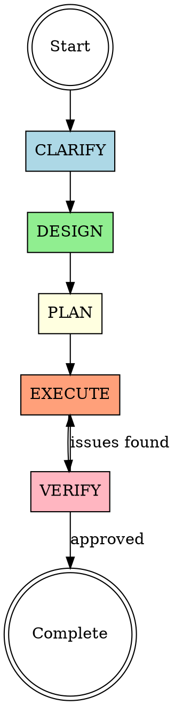

# Superpowers Universal

A disciplined 5-phase workflow for complex tasks: **CLARIFY → DESIGN → PLAN → EXECUTE → VERIFY**

<EXTREMELY-IMPORTANT>
If you think there is even a 1% chance this workflow applies, you MUST use it.

NO ACTION without first clarifying intent and designing approach.
</EXTREMELY-IMPORTANT>

## Quick Start

**When user starts a complex task:**

1. Announce: "I'll use the Superpowers Universal workflow for this task."
2. Read `references/workflow-overview.md` for complete framework
3. Start with **CLARIFY** phase by reading `references/clarify.md`
4. Follow the phase sequence, reading each phase's reference file as you progress

## The 5-Phase Workflow



## Phase Reference Files

Read each file when entering that phase:

| Phase | Reference File | When to Read |
|-------|---------------|--------------|
| **CLARIFY** | `references/clarify.md` | At start of any new task |
| **DESIGN** | `references/design.md` | After intent is clear |
| **PLAN** | `references/plan.md` | After approach is approved |
| **EXECUTE** | `references/execute.md` | When ready to do the work |
| **VERIFY** | `references/verify.md` | When work appears complete |

## Workflow Navigation

### Starting a New Task

```
User: "I need to [complex task]"
↓
Read: references/workflow-overview.md
↓
Read: references/clarify.md
↓
Execute CLARIFY phase
```

### Moving Between Phases

**CLARIFY → DESIGN:**
- When user intent is understood
- When you can summarize back what they want
- Read: references/design.md

**DESIGN → PLAN:**
- When user approves the approach
- Read: references/plan.md

**PLAN → EXECUTE:**
- When plan is complete and approved
- Read: references/execute.md

**EXECUTE → VERIFY:**
- When all tasks complete
- Read: references/verify.md

**VERIFY → (back to EXECUTE):**
- When issues found during verification
- Re-read: references/execute.md

### Emergency Shortcuts

**Truly trivial task** (< 5 min, zero ambiguity):
- Skip to EXECUTE phase
- Read: references/execute.md only

**User explicitly requests a phase:**
- "进入 CLARIFY 阶段" → Read: references/clarify.md
- "进入 DESIGN 阶段" → Read: references/design.md
- etc.

## Red Flags - STOP and Reassess

| Thought | Action |
|---------|--------|
| "This is just a quick thing" | Read workflow-overview.md, assess if truly trivial |
| "I know what they want" | Read clarify.md, confirm with user |
| "Let me get started" | Check current phase, complete it first |
| "We don't have time for process" | Read workflow-overview.md, remember: skipping wastes more time |

## Integration with Domain Skills

Superpowers Universal manages **process**, domain skills manage **craft**.

**Example workflow with writing skill:**
1. CLARIFY: Understand article requirements (Superpowers)
2. DESIGN: Decide on narrative approach (Superpowers)
3. PLAN: Outline sections (Superpowers)
4. EXECUTE: Write using domain writing skills (Domain skill)
5. VERIFY: Check against original intent (Superpowers)

## Key Principles

1. **Read phase files progressively** - Don't load all references at once
2. **Complete each phase before next** - No skipping forward
3. **One question at a time in CLARIFY** - Dialogue over monologue
4. **Get explicit approval** - Before moving DESIGN → PLAN, PLAN → EXECUTE
5. **Verify before declaring done** - EXECUTE without VERIFY is incomplete

## Reference File Structure

```
references/
├── workflow-overview.md    # Complete framework (read first)
├── clarify.md              # Phase 1: Understand intent
├── design.md               # Phase 2: Create approach
├── plan.md                 # Phase 3: Break into steps
├── execute.md              # Phase 4: Do the work
└── verify.md               # Phase 5: Check quality
```

## Usage Examples

See `references/examples.md` for complete worked examples:
- Writing an important email
- Planning a team offsite
- Analyzing a business problem
